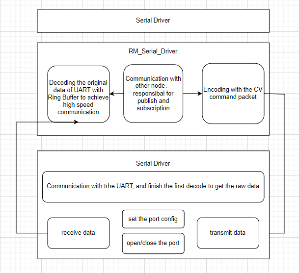
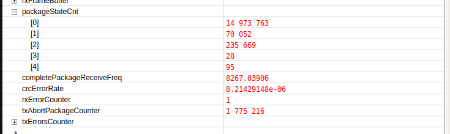
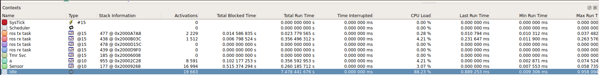
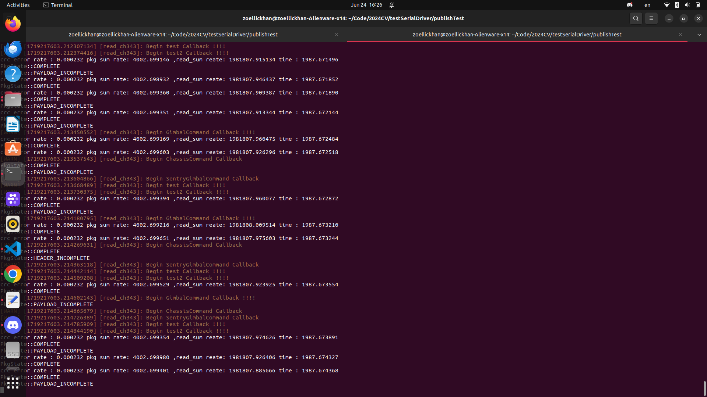

# 基于CH343芯片的UART通信上位机处理
## 1. 环境

* 软件环境
  * Ubuntu 22.04 
  * ROS2 humble
  *  [CH343的Linux环境下的vcp驱动](https://github.com/WCHSoftGroup/ch343ser_linux)
  * 配套的下位机代码处理

* CH343的Linux环境下的vcp驱动安装
  * 需要注意的是驱动安装时需要使用gcc12,并且需要将已经Linux原有的cdc-acm驱动删除

  * 删除cdc-acm驱动
  ```
  sudo rmmod cdc-acm
  ls /dev/ttyACM*
  ```
  * 安装驱动,需要在安装前关闭security boot, 否则有可能出现签名认证失败的报错.具体安装详见驱动的README.md
  ```
  git clone https://github.com/WCHSoftGroup/ch343ser_linux
  ```
  * 更换gcc版本
  ```
  sudo apt install gcc-12
  sudo update-alternatives --install /usr/bin/gcc gcc /usr/bin/gcc-12 100 --slave /usr/bin/g++ g++ /usr/bin/g++-12 --slave /usr/bin/gcov gcov /usr/bin/gcov-12
  sudo update-alternatives --install /usr/bin/gcc gcc /usr/bin/gcc-11 80 --slave /usr/bin/g++ g++ /usr/bin/g++-11 --slave /usr/bin/gcov gcov /usr/bin/gcov-11
  gcc --version        // if it is 12, that is ok
  ```
  
  * 检查,如果有/dev/ttyUSBCH3430(1/2),就可以了.

    ```
    ls /dev/tty* 
    ```

## 2.文件说明

### 2.1 serialDriver.cpp 和 serialDriver.hpp
* 整合了serial driver对于串口数据读写，对于串口设置更改，打开关闭串口，统计原始收发数据等具体功能。
* 并且设计了向上层节点的调用接口，分离了部分C语言实现的操作。

### 2.2 protocol.hpp
* 用于定义不同的数据包。主要是根据不同兵种机器人所需要的上下位机沟通的数据类型。
* 采用双CRC，对包里的数据进行高效的保护和校验。同时便于接收端的数据处理
* 在包头填充了关于整个数据包的相关数据，具有主要实际意义的是数据包的长度和ID.以及包头部分的CRC
  * uint8_t sof = 0xAAu;
  * uint8_t dataLen = 0;
  * uint8_t protocolID = 0;
  * uint8_t crc_1;
  * uint8_t crc_2;

### 2.3 RMserialDriver.cpp 和 RMserialDriver.hpp
* 数据处理的主体部分，对于上位机串口接收的数据进行高速的处理。
* 接受端采用了类似于环形缓冲的想法，在此基础上使用双crc保护数据。第一时间将数据存储到缓冲区里，先按照顺序处理剩余数据长度，如果符合header的长度，然后对于数据的header部分进行解包。再判断剩余数据是否符合一整个packet的数据长度，如果符合则进行整包crc校验，成功则处理整个packet的数据并将其分流到对应结点的publish，并且把已经处理的数据丢弃。如果出现剩余数据不满足header或者packet长度，则暂时保留，等到下一轮数据进入缓冲区再进行判断。



## 3. 实际效果及测试数据

### 3.1 实际效果
* 测试阶段可达到的最大稳定带宽为双工3M波特率
* 实际比赛时为了更高的正确率和更高的稳定性，采用了双工2M，可支持至少4个ROS节点
### 3.2 测试条件：
  * UART: 2M异步，stop bits = 2,  oversample = 16, simple sample = true, 无校验位，start bit = 1, 数据位8bits

  * 上位机（同一个serial driver node. 开tx与rx线程）
    * TX: 五个Node 1ms txcallback, 每个callback分别传两种CMD
        * TWOCRC_CHASSIS-CMD
        * TWOCRC-GIMBAL-CMD
        * TWOCRC-SENTRY-GIMBAL-CMD
        * TWOCRC-GIMBAL-MSG
      TWOCRC-ACTION-CMD
    * RX: 单个线程read + 通用decode + publish

  * 下位机：
    * TX: 调用NewRosComm transmit API, 每毫秒传输五个TWOCRC-GIMBAL-MSG
    * RX：下位机通用decode

### 3.2 实验效果







## 4.未来优化方向
  * 上下位机进行时间戳同步，同时通讯延时
  * 增加可用带宽，实现更高速通信
  * 优化缓冲区数据处理方式，降低CRC错误率
  * 冗余带宽可以用来其他数据的传输以及保存，例如下位机产生的log文件可以通过uart存储在上位机，便于比赛之后复盘分析原因
  * 增加上位机的解算，完成一部分UI定位辅助的功能
  * 整合节点数据结构，清理冗余变量，化简节点间无效通讯